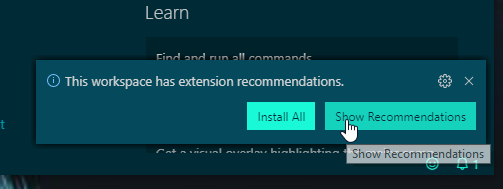
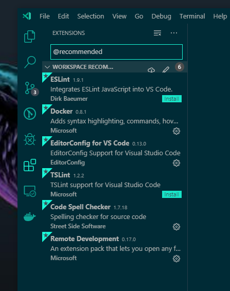
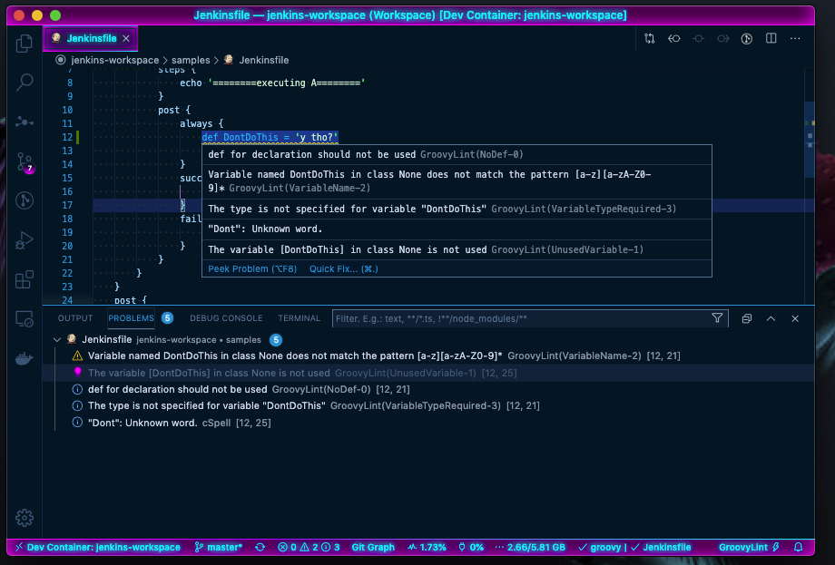
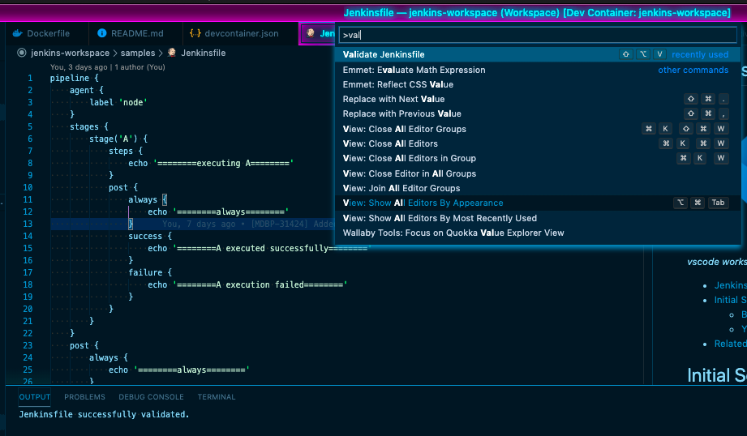

# jankins-workspace

  
[](https://hub.docker.com/r/calebhankins/jankins-workspace/)
[](https://hub.docker.com/r/calebhankins/jankins-workspace/)

*A Containerized workspace for Jenkins Shared Libraries written in groovy, using vscode Remote - Containers*

- [jankins-workspace](#jankins-workspace)
- [Initial Setup](#initial-setup)
- [Pre-Req Checklist](#pre-req-checklist)
  - [TL;DR](#tldr)
  - [Docker](#docker)
  - [.ssh Folder](#ssh-folder)
  - [vscode](#vscode)
    - [vscode extensions](#vscode-extensions)
  - [Before Your First Run](#before-your-first-run)
  - [Your First Run](#your-first-run)
- [Workspace Features](#workspace-features)
  - [The Workspace Itself](#the-workspace-itself)
  - [Groovy Lint](#groovy-lint)
  - [Jenkins-Pipeline-Linter-Connector](#jenkins-pipeline-linter-connector)
  - [Release Management](#release-management)
- [Updates](#updates)
- [Related Links & Credits](#related-links--credits)


# Initial Setup
This repository is my local dev env and is meant to serve as an example or demo. It will need some finesse to meet your local host's needs. The [devcontainer.json](.devcontainer/devcontainer.json) will need to be tweaked to suite your environment before you start.

**In my [devcontainer.json](.devcontainer/devcontainer.json) I am interacting with my `$HOME` directory's files via [docker's mount](https://docs.docker.com/storage/bind-mounts/) which you might not be in to. Please review the code this file intends to execute before running via [vscode remote containers](https://code.visualstudio.com/docs/remote/containers). and make sure you're good with that.** This workspace will still function without mounting your `$HOME`, but you will need to tweak the devcontainer and comment out anything that references mounting `${env:HOME}`, `${env:USERPROFILE}` or `~` first so the `docker run` command that vscode generates will not fail.

# Pre-Req Checklist

## TL;DR
- [vscode's remote - containers: Getting Started](https://code.visualstudio.com/docs/remote/containers#_getting-started)


## Docker
- [Docker Desktop running locally](https://www.docker.com/products/docker-desktop)
- You must have local volume mounts working to get the most out of this guide. You can test you local drive mounting with the following code:

```powershell
# This should print the contents of your host OS home folder. 
docker run --rm -v ~:/data node:lts-alpine ls /data
```

## .ssh Folder
This workspace is setup to be a starting development workspace. To hit the ground running with version control integration, the [devcontainer.json](.devcontainer/devcontainer.json) is set to mount files from your host `~/.ssh` folder. If you don't have one of these, you can create the following files on your host, or comment out the `.ssh/*` entries in the `mounts` section of the [devcontainer.json](.devcontainer/devcontainer.json) file.

```bash
# Expected ssh files on host
~/.ssh/id_rsa
~/.ssh/id_rsa.pub
~/.ssh/known_hosts
~/.ssh/authorized_keys
```

## vscode
- [vscode](https://code.visualstudio.com/download) or [vscode insiders](https://code.visualstudio.com/insiders/) if you're a cool kid.
  - You will need v1.38+ to use the `Remote - Containers` feature.
  - As of 2019-09-18, I'd recommend using [Insiders](https://code.visualstudio.com/insiders/) as these features are still in Preview and Insiders gets bug fixes sooner.


### vscode extensions
*Note, if you open the root folder of this project in vscode, you should get a prompt to install the recommended extensions.*

- 
- 

- Required
  - [Remote - Containers](https://marketplace.visualstudio.com/items?itemName=ms-vscode-remote.remote-containers)
- Recommended
  - For the full list of recommended extensions, checkout the [extensions.json](.vscode/extensions.json) file included in this repository.

## Before Your First Run
Inspect the [devcontainer.json](.devcontainer/devcontainer.json) file, paying close attention to the **`mounts`** section. Any bind mounts pointed to folders that don't exist for you will cause the build to fail. Please customize these to meet your needs before your first run.

You should also create a `~/.jankins/.env` file prior to your first run if you'd like to change your Jenkins env prior to launch. (**or** comment out the --env-file in the [devcontainer.json's runArgs](.devcontainer/devcontainer.json)). Set any environment variable that you'd like your devcontainer to use in here. If you don't do either if these, the container initialization will stub out a default config file at `~/.jankins/.env` for you. This file will be created at runtime if it doesn't exist (see [devcontainer.json's initializeCommand](.devcontainer/devcontainer.json) for more info).

```bash
mkdir -p ~/.jankins
touch ~/.jankins/.env
```

Sample jankins env file with environment overrides:

```ini
JENKINS_USER='admin'    # Set the Jenkins Service Account username
JENKINS_PASSWD='admin'  # Set the Jenkins Service Account passwd
JENKINS_EXECUTORS=1     # Set the number of Jenkins Executors
JENKINS_ON_BOOT=false   # Don't run the Jenkins service in the background when booting the container
```

See the [Dockerfile](.devcontainer/Dockerfile) and [devcontainer.json](.devcontainer/devcontainer.json) for more information and configuration points.

*🦢 Pro-tip: Any environment setting that you'd like in your workspace can be set here and will propagate with the default repo configuration!*

## Your First Run
For your first run, connect to your [local Jenkins](http://0.0.0.0:8080) and complete the setup that way that you'd prefer. The Jenkins plugins required for the `Validate Jenkinsfile` vscode extension should be pre-installed, but you can add additional features as needed for your use case. Customization should be persisted through builds through the use of docker volumes that have been pre-configured in the supplied [devcontainer.json](.devcontainer/devcontainer.json).

When you've configured a user account, you can set your login information for the [`jenkins-pipeline-linter-connector` vscode extension](https://marketplace.visualstudio.com/items?itemName=janjoerke.jenkins-pipeline-linter-connector), which will allow you to use the `Validate Jenkinsfile` extension action.

# Workspace Features
## The Workspace Itself
Included in this project is a [jankins-workspace.code-workspace](./jankins-workspace.code-workspace) file that is used to set workspace level settings and tie multiple folders together to form a cohesive work environment. Once you have re-opened this project in a container, you should be able to launch this workspace.

*🦢 Pro-tip: See [node-playground](https://github.com/calebHankins/node-playground) and [vscode Remote - Containers](https://code.visualstudio.com/docs/remote/containers) for more information and examples!*


## Groovy Lint
- [Groovy Lint, Format and Fix](https://marketplace.visualstudio.com/items?itemName=NicolasVuillamy.vscode-groovy-lint) is probably the most useful ext installed in this workspace. This [ext](https://marketplace.visualstudio.com/items?itemName=NicolasVuillamy.vscode-groovy-lint) and [related npm project](https://github.com/nvuillam/npm-groovy-lint#README) provide linting and formatting tools for Groovy/Jenkinsfiles and helpful links to [CodeNarc](https://codenarc.github.io/CodeNarc/) documentation.




The linter can also be ran as a cli tool:

```bash
npm-groovy-lint

# npm-groovy-lint results in  linted files:
# ┌─────────┬───────────┬─────────────┐
# │ (index) │ Severity  │ Total found │
# ├─────────┼───────────┼─────────────┤
# │    0    │  'Error'  │      0      │
# │    1    │ 'Warning' │      0      │
# │    2    │  'Info'   │      0      │
# └─────────┴───────────┴─────────────┘
```


## Jenkins-Pipeline-Linter-Connector
[`jenkins-pipeline-linter-connector` vscode extension](https://marketplace.visualstudio.com/items?itemName=janjoerke.jenkins-pipeline-linter-connector), adds `Validate Jenkinsfile` extension action. I usually use this at least once before uploading my jenkinsfile changes to origin to catch anything that that [linter](#groovy-lint) didn't catch.




## Release Management
Release management for our components is being managed via [Release It! 🚀](https://github.com/release-it/release-it#release-it-). If not using this tool, make sure to update the version manually in the target project's package.json, package-lock.json (if the project has these files), and the [git tag](https://github.com/release-it/release-it/blob/master/docs/git.md).

```bash
# Example minor release of this workspace project
release-it minor --src.commitMessage="[Release] v%s Added Release Management section and global tooling"

# 🚀 Let's release jankins-workspace (0.1.1...0.2.0)

# Changelog:
# * Added Release Management section and global tooling (74703a5)

# ! npm version 0.2.0 --no-git-tag-version
# $ git status --short --untracked-files=no

# Empty changeset

# !
# ? Commit (Release 0.2.0)? Yes
# !
# ? Tag (0.2.0)? Yes
# !
# ? Push? Yes
# $ git symbolic-ref HEAD [cached]
# $ git for-each-ref --format="%(upstream:short)" refs/heads/master [cached]
# !
# 🏁 Done (in 9s.)
```
# Updates

At the time of this writing, there's no elegant way to have vscode remote container's [`docker run`](https://docs.docker.com/engine/reference/commandline/run/) execute a `--pull` to grab a newer copy of the base image if it exists.
    *🦢 Although it looks like that is in the works!*

If you are using the :latest tag and would like an updated version, you can run a pull manually with a command like this:
```bash
docker pull calebhankins/jankins:latest
```
See [`docker pull`](https://docs.docker.com/engine/reference/commandline/pull/) for more information.

You can review and override the base image via the [devcontainer.json](.devcontainer/devcontainer.json)'s [build.args](https://code.visualstudio.com/docs/remote/containers#_devcontainerjson-reference) `BASE_IMAGE` if you'd like a different base image or a pinned version. 

# Related Links & Credits
- [Jake Wernette's awesome series on Jenkins Shared Libraries](https://itnext.io/jenkins-shared-libraries-part-1-5ba3d072536a).
- [jankins](https://github.com/calebHankins/jankins), a pre-rolled image with Jenkins, Groovy, Maven and related tooling support already installed.
  - [Official Jenkins Docker image Github Repo](https://github.com/jenkinsci/docker/blob/master/README.md)
    - [Dockerfile we're basing this workspace on](https://github.com/jenkinsci/docker/blob/master/Dockerfile).
- [node-playground](https://github.com/calebHankins/node-playground) - A Containerized playground for experimenting with Node.js using vscode's Remote - Containers feature.
  - [vscode Remote - Containers](https://code.visualstudio.com/docs/remote/containers) official page
- [jankins](https://github.com/calebHankins/jankins) logo derived from the [Jenkins project](https://jenkins.io/) artwork, supplied by [@jvanceACX](https://github.com/jvanceACX).
- [vscode logo Copyright (c) Microsoft Corporation](https://github.com/Microsoft/vscode/).

